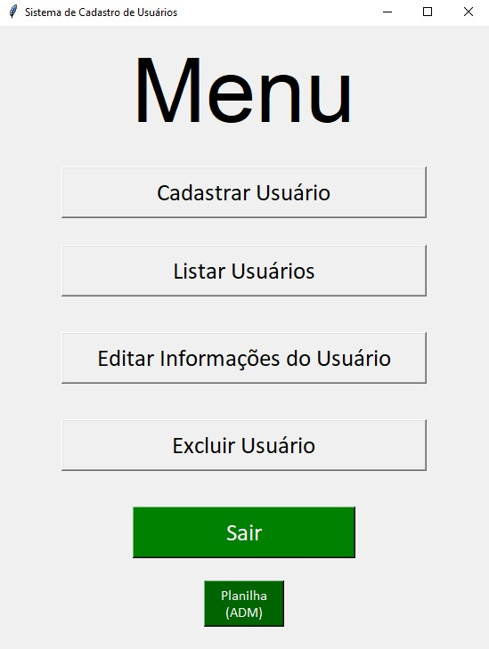
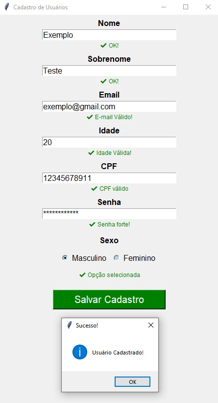
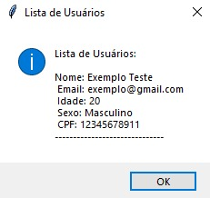
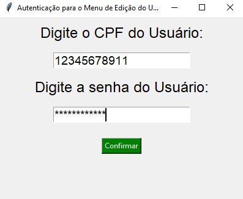
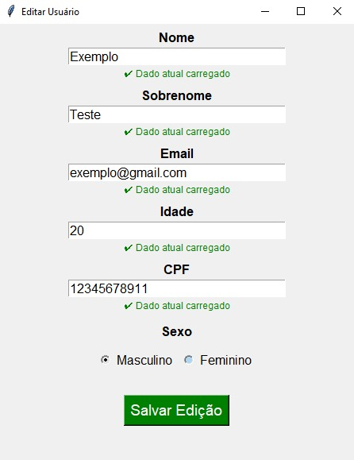
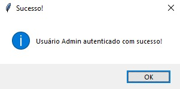
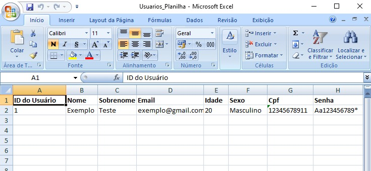

## Pré-requisitos
* Python 3.10 ou superior.
* Sistema operacional Windows (devido ao uso de bibliotecas nativas do sistema em alguns componentes do Tkinter).

## SISTEMA DE CADASTRO DE USUÁRIOS

Este projeto é uma aplicação desktop completa para gerenciamento de usuários, desenvolvida em Python. O sistema foca em uma experiência de usuário (UX) fluida, oferecendo validações em tempo real e um banco de dados persistente para armazenamento seguro de informações.

### SOBRE O PROJETO

O sistema foi projetado para resolver a necessidade de cadastros organizados, permitindo que administradores gerenciem dados e exportem relatórios de forma automatizada. A arquitetura foi separada em três camadas (Interface, Lógica e Banco de Dados) para garantir um código limpo e fácil de manter.

## FUNCIONALIDADES PRINCIPAIS

**Gestão Completa de Usuários (CRUD):** Permite cadastrar, listar, editar e excluir registros diretamente pela interface.

**Validação em Tempo Real:** O sistema verifica e-mails, senhas fortes e CPFs enquanto o usuário digita, oferecendo feedback visual através de cores (verde para correto, vermelho para erro).

**Armazenamento:** Utiliza o banco de dados SQLite, garantindo que as informações fiquem salvas localmente em um arquivo .db.

**Exportação para Excel:** Possui um módulo que gera planilhas formatadas (.xlsx) automaticamente, com cabeçalhos em negrito e ajuste de colunas.

**Painel De Controle:** Área protegida por credenciais de administrador para funções sensíveis, como exportação de dados e limpeza do banco.

## TECNOLOGIAS UTILIZADAS

**Python:** Linguagem base do projeto.

**Tkinter:** Para o desenvolvimento de toda a interface gráfica.

**SQLite:** Para persistência e manipulação de dados relacionais.

**Openpyxl:** Para a criação e formatação profissional de arquivos Excel.

## ESTRUTURA DO CÓDIGO

O projeto segue uma estrutura modular para facilitar a escalabilidade:

**Sistema_de_Cadastro.py:** Responsável pela interface gráfica e interação direta com o usuário.

**cadastro_base.py:** Contém as regras de negócio e validações lógicas do sistema.

**Banco_de_Dados.py:** Gerencia todas as operações de banco de dados e a geração de planilhas.

## COMO EXECUTAR

Certifique-se de ter o Python instalado.

Instale a biblioteca externa necessária:

**pip install openpyxl**

Execute o arquivo principal:

**Sistema_de_Cadastro.py**

## Lições Aprendidas
* **Modularização:** Divisão de responsabilidades entre interface, lógica e persistência.
* **UX/UI no Tkinter:** Implementação de feedbacks visuais dinâmicos para melhorar a experiência do usuário.
* **Manipulação de Dados:** Integração entre banco de dados relacional (SQL) e exportação para arquivos não relacionais (Excel).

## FOTOS DO SISTEMA

**Menu Principal do Sistema**

	

**Menu de Cadastro**

 

**Lista de Usuários Cadastrados**

		

**Menu de Autenticação para Edição**

 

**Menu de Edição dos dados**

 

**Menu de Autenticação ADM**

**Menu do ADM**

 

**Planilha com Dados do Banco**

## Autor
Desenvolvido por **Thiago Soares** – [ThiagoOlSoa](https://linkedin.com/in/thiagoolsoa) – thiagoosoa0201@gmail.com
